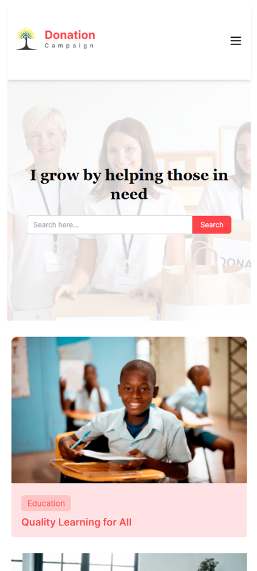

# 🌱 iGrow Donation Campaign

A visually engaging and interactive **React client-side web application (SPA)** built for a donation campaign platform. Users can browse causes, view statistics, donate to specific categories, and track their donations – all locally stored for realistic demo testing.

---

## 🚀 Live Site

🔗 [Visit Live Site](https://igrow-donation-campaign.web.app/)

---

## 🖼️ Screenshots

### ✅ Desktop View

### 📱 Mobile View

---

## 🚀 Key Features

- ✅ Clean and Responsive UI (TailwindCSS)
- ✅ Dynamic Routing using `react-router-dom`
- ✅ Donation tracking using `localStorage`
- ✅ SweetAlert integration
- ✅ Real-time donation statistics with pie chart (`Recharts`)
- ✅ Remove or reset donations
- ✅ Final donation confirmation logic
- ✅ Category-based card filtering
- ✅ Real-time total donation calculation

---

## ⚙️ Technologies Used

- ⚛️ React.js
- 🎨 Tailwind CSS
- 📊 Recharts
- 🔔 SweetAlert
- 📦 LocalStorage
- 🌐 React Router DOM

---

## 🧪 Testing Tips

To reset donation history (for testing):
- Scroll to the bottom of the Donation page
- Click the button: `Reset All Donations`

---

## 💡 Project Status

✅ Fully functional  
✅ Can be extended in the future

---

## 📛 Logo Idea

Tree-shaped — a symbol of growth  

---

## 🤝 License

This project is open for practice and learning purposes. Contact the author for permission if reusing for commercial use.
